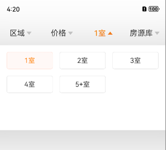
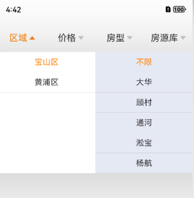

# FilterBar

## 简介

> FilterBar是一款OpenHarmony环境下可用的筛选组件，使用频次很高。
> 支持单列、双列、单选、双选，使用者可根据自己需求配置。

## 截图

| 网格多选                               | 网格单选                              | 列表                            | 双列表                            |
|------------------------------------|-----------------------------------|-------------------------------|--------------------------------|
|  |  |  |  |

## 效果展示


## 安装

> ohpm install filterbar

## 版本和设备

| /             | 版本             |
|---------------|----------------|
| DevEco Studio | 4.1 Canary2    |
| SDK           | **10**             |
| 设备            | Emulator(Next) |

## 属性说明

### filterbar

| 属性                  | 类型                     | 含义     | 必传  | 备注    |
|---------------------|------------------------|--------|-----|-------|
| []() filterDataList | 数组                     | 筛选项数据源 | Y   |       |
| callback            | (CallBackData) => void | 回调函数   | Y   | 回调给下游 |

## 数据源配置说明

 **筛选项item抽象类**

| 接口          | 说明                                    |
|-------------|---------------------------------------|
| IFilterItemData | 根据业务情况，筛选项除了展示的title之外的附带数据(比如id)，实现此接口即可 |

**SingleFilterData**
> 单列、网格单选/多选使用此model

| 成员变量           | 类型      | 含义      | 必传  | 备注            |
|----------------|---------|---------|-----|---------------|
| []() isGrid    | boolean | 是否是网格布局 | Y   |               |
| isSingleChoice | boolean | 单选or多选  | Y   | 注意：多选仅对网格布局有效 |

**TwoListFilterData**
> 双列联动使用此model

## 使用说明

```typescript
import ArrayList from '@ohos.util.ArrayList'
import promptAction from '@ohos.promptAction'
import {
  SingleFilterData,
  TwoListFilterData,
  TwoListLeftData,
  FilterBar,
  AbsFilterData,
  FilterItemData,
} from '@liyixin/filterbar'

@Entry
@Component
struct Index {
  private dataList: ArrayList<AbsFilterData> = new ArrayList()

  aboutToAppear(): void {
    ///宝山
    let tabList1: FilterItemData[] = []
    tabList1[0] = new FilterItemData('不限')
    tabList1[1] = new FilterItemData('大华')
    tabList1[2] = new FilterItemData('顾村')
    tabList1[3] = new FilterItemData('通河')
    tabList1[4] = new FilterItemData('淞宝')
    tabList1[5] = new FilterItemData('杨航')
    ///黄浦区
    let tabList4: FilterItemData[] = []
    tabList4[0] = new FilterItemData('不限')
    tabList4[1] = new FilterItemData('打浦桥')
    tabList4[2] = new FilterItemData('董家渡')
    tabList4[3] = new FilterItemData('淮海中路')
    tabList4[4] = new FilterItemData('人民广场')
    tabList4[5] = new FilterItemData('世博滨江')
    tabList4[6] = new FilterItemData('新天地')

    ///双列
    let twoListItemDataList: TwoListLeftData[] = []
    twoListItemDataList[1] = new TwoListLeftData('黄浦区', tabList4)
    twoListItemDataList[0] = new TwoListLeftData('宝山区', tabList1)
    this.dataList.add(new TwoListFilterData('区域', twoListItemDataList))

    //单列表
    let tabList2: FilterItemData[] = []
    tabList2[0] = new FilterItemData('不限')
    tabList2[1] = new FilterItemData('200万以下')
    tabList2[2] = new FilterItemData('200-250万')
    tabList2[3] = new FilterItemData('250-300万')
    tabList2[4] = new FilterItemData('300-400万')
    tabList2[5] = new FilterItemData('400-500万')
    this.dataList.add(new SingleFilterData('价格', false, true, tabList2))

    //网格
    let tabList3: FilterItemData[] = []
    tabList3[0] = new FilterItemData('1室')
    tabList3[1] = new FilterItemData('2室')
    tabList3[2] = new FilterItemData('3室')
    tabList3[3] = new FilterItemData('4室')
    tabList3[4] = new FilterItemData('5+室')
    this.dataList.add(new SingleFilterData('房型', true, false, tabList3))
    //单列表
    let tabList5: FilterItemData[] = []
    tabList5[0] = new FilterItemData('不限')
    tabList5[1] = new FilterItemData('智能排序')
    tabList5[2] = new FilterItemData('最新挂牌')
    this.dataList.add(new SingleFilterData('房源库', true, true, tabList5))
  }

build() {
    Column() {
      FilterBar({
        filterDataList: this.dataList.convertToArray(),
        callback: (data) => {
          promptAction.showToast({
            message: `tabIndex:${data.tabIndex}, value: ${data.itemDataList.map((v) => v.title).join(',')}`
          })
        }
      }).margin({ left: 0, right: 0, top: 20 })
    }
.height('100%')
  .width('100%')
}
}
```

## 贡献代码

使用过程中发现任何问题都可以提 Issue 给我，当然，我们也非常欢迎你给我发 PR 。

## 开源协议

本项目基于 Apache License 2.0 ，请自由地享受和参与开源。

## 遗留问题

暂无
