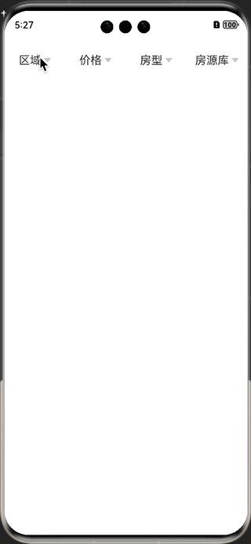

# FilterBar

## 简介

> FilterBar是一款OpenHarmony环境下可用的筛选组件，使用频次很高。

## 效果展示



## 安装

> ohpm install filterbar

## 使用说明

```typescript
@Entry
@Component
struct Index {
  private dataList: ArrayList<FilterData> = new ArrayList()

  aboutToAppear(): void {
    this.dataList.add(new SingleFilterData('区域', ['不限', '宝山区', '崇明区', '长宁区', '普陀区', '嘉定区', '松江区', '静安区']))
    this.dataList.add(new SingleFilterData('价格', ['200万以下', '200-250万', '250-300万', '300-400万', '400-500万']))
    this.dataList.add(new SingleFilterData('房型', ['1室', '2室', '3室', '4室', '5室及以上']))
    this.dataList.add(new TwoListFilterData('板块', [
      ['xx', 'xx'],
      ['xx', 'xxx']
    ]))
  }

build()
{
    Column() {
      FilterBar({
        tabDataList: this.dataList.convertToArray(),
        callback: (data) => {
          promptAction.showToast({
            message: `tabIndex:${data.tabIndex}, valueIndex: ${data.valueIndex}, value: ${data.data}`
          })
        }
      }).margin({ left: 0, right: 0, top: 20 })
    }
.
height('100%').width('100%')
}
}
```

## 属性说明

### filterbar

| 属性             | 类型         | 含义     | 必传  | 备注    |
|----------------|------------|--------|-----|-------|
|[]() filterDataList | 数组         | 筛选项数据源 | Y   |       |
| callback       | (CallBackData) => void | 回调函数   | Y   | 回调给下游 |

## 测试

在下述版本验证通过：

DevEco Studio 4.1 Canary2, SDK: API10 , Emulator

## 贡献代码

使用过程中发现任何问题都可以提 Issue 给我，当然，我们也非常欢迎你给我发 PR 。

## 开源协议

本项目基于 Apache License 2.0 ，请自由地享受和参与开源。

## 遗留问题

1、仅支持单列的popup，双列联动后续支持。

2、Popup的x轴偏移量需要计算，tab数量可能会影响计算，后续统一公式计算。
